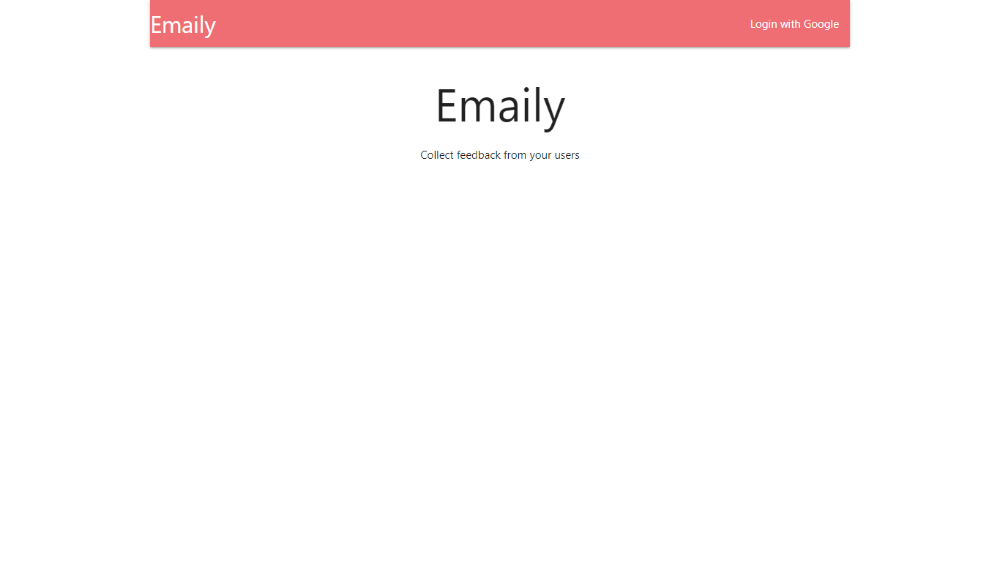
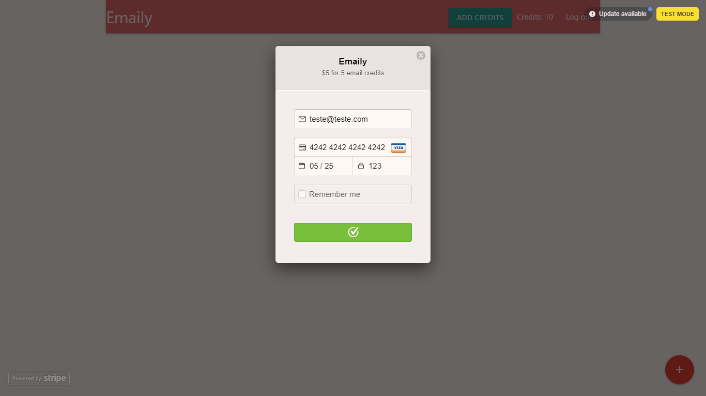
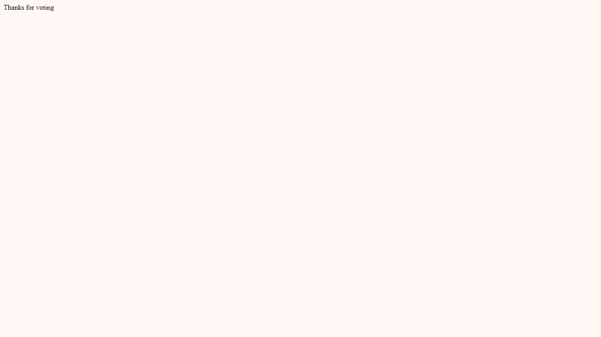

<h1 align="center">
    Emaily
</h1>

  <a href="#rocket-tecnologias">Tecnologias</a>&nbsp;&nbsp;&nbsp;|&nbsp;&nbsp;&nbsp;
  <a href="#-projeto">Projeto</a>&nbsp;&nbsp;&nbsp;|&nbsp;&nbsp;&nbsp;
  <a href="#-layout">Layout</a>&nbsp;&nbsp;&nbsp;|&nbsp;&nbsp;&nbsp;
  <a href="#-como-contribuir">Como contribuir</a>&nbsp;&nbsp;&nbsp;|&nbsp;&nbsp;&nbsp;
  <a href="#memo-licença">Licença</a>

 

  

 

## Web

<a href="https://safe-brushlands-69741.herokuapp.com/">Emaily</a>

  
    
    
    
    
    
    
    
    
    
    
    
  

## 🚀 Tecnologias

Esse projeto foi desenvolvido com as seguintes tecnologias:

- [Node.js](https://nodejs.org/en/)
- [React](https://reactjs.org)
- [Redux](https://redux.js.org/)
- [Redux Form](https://redux-form.com/8.3.0/)
- [Typescript](https://www.typescriptlang.org/)
- [Stripe](https://stripe.com/)
- [SendGrid](https://sendgrid.com/)
- [Heroku](https://www.heroku.com/)

## 💻 Projeto

O Emaily é uma plataforma desenvolvida para facilitar a coleta de feedback dos clientes de todas os tipos de empresas.

## 🔖 Layout

Estou trabalhando no desenvolvimento do layout...

## 🤔 Como contribuir

- Faça um fork desse repositório;
- Cria uma branch com a sua feature: `git checkout -b minha-feature`;
- Faça commit das suas alterações: `git commit -m 'feat: Minha nova feature'`;
- Faça push para a sua branch: `git push origin minha-feature`.

Depois que o merge da sua pull request for feito, você pode deletar a sua branch.

## :memo: Licença

Esse projeto está sob a licença MIT. Veja o arquivo [LICENSE](LICENSE.md) para mais detalhes.

---
